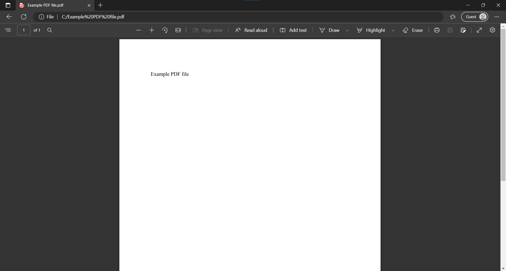
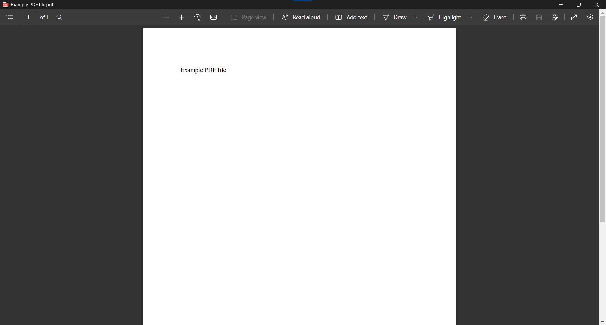
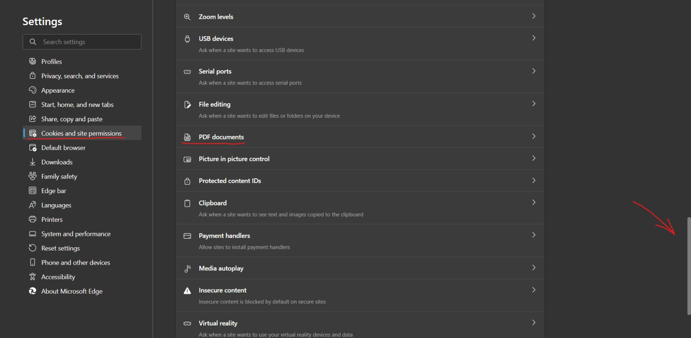
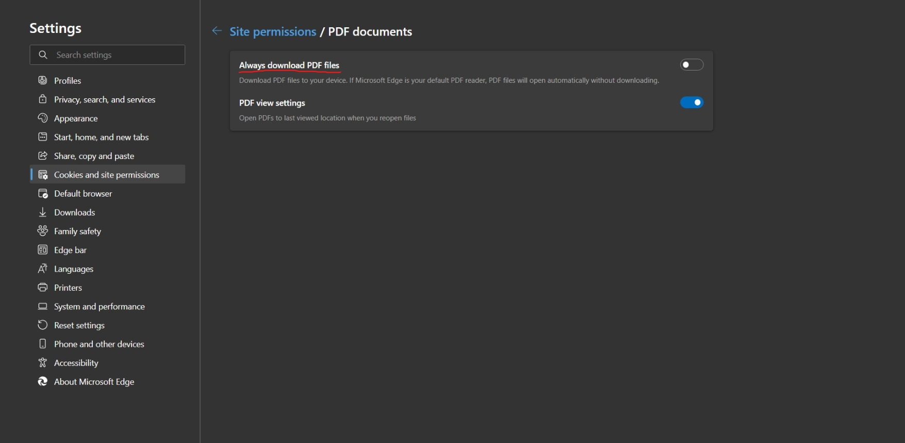
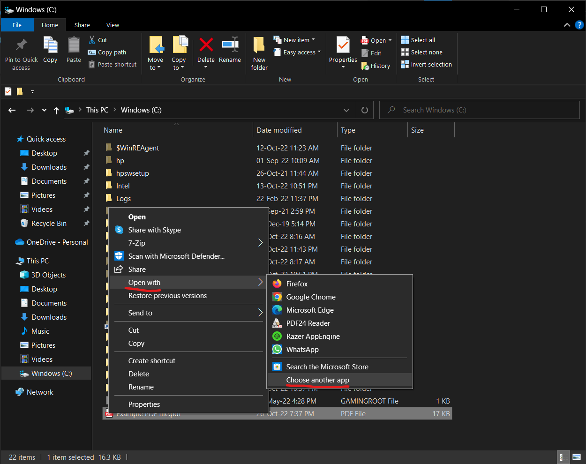
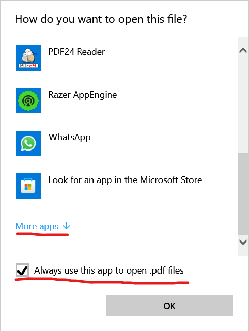
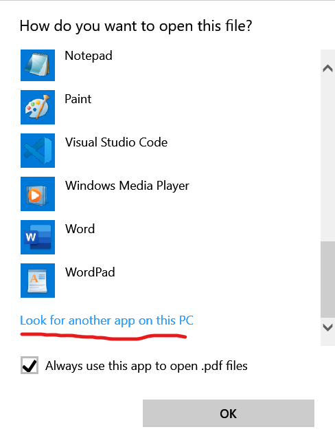
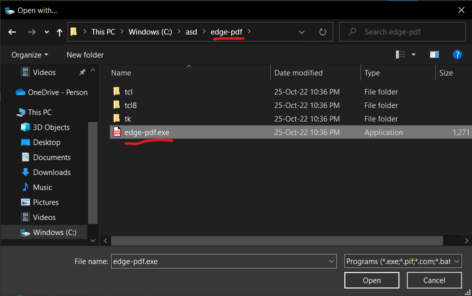

# edge-pdf

If you and I have a few things in common, then it would be that:

-   We both use Mozilla Firefox as our web browser
-   We both set MS Edge as the default app to open PDF files
-   We both realized that double-clicking recently downloaded PDF files in Firefox launches MS Edge but with a slightly different UI
-   We both spent hours trying to figure out how to open PDF files with MS Edge, in that specific look, without going through Firefox, but to no avail

If the last point somewhat fits your description and you've stumbled upon here, then `edge-pdf` is what you're looking for.

## What Is This?

`edge-pdf` is an executable that opens .pdf files with MS Edge in application/app mode, which hides the browser's toolbar. To my knowledge, app mode is actually used to prevent users from using MS Edge to browse the web. But that works in my favor, as I intent to use MS Edge for opening PDF files only.

Here's a comparison shot of opening a PDF file using MS Edge vs `edge-pdf`:

Opened using MS Edge

Opened using `edge-pdf`

## How Does It Work?

`edge-pdf` simply executes the command line `start msedge "--app=<filepath-to-pdf-file> --start-maximized"`, where `<filepath-to-pdf-file>` is the PDF file that you choose to `Open With edge-pdf.exe`. I've added `--start-maximized` to maximize the window automatically when opening a file.

It is not an standalone desktop app, nor does it have a GUI. `edge-pdf` should be thought of as a shortcut to execute the command line stated above, but in the executable (.exe) format so users can configure `edge-pdf.exe` as the default program to open PDF files.

## Installing and Setting Up `edge-pdf`

### Prerequisites

1.  You're using a Windows PC

    If you're on different OS, and dead set on using MS Edge as the default PDF Editor, you can try:

    -   Building the "app" yourself using the `src` folder, which requires some knowledge on programming using Python and PyInstaller, or
    -   Use an external program to run `edge-pdf.exe`

2.  You have MS Edge installed
3.  You **actually** use MS Edge as your go-to PDF viewer and editor

### Step-By-Step

1.  Download and extract `edge-pdf.zip` from the [Releases](https://github.com/ARipeAppleByYoursTruly/edge-pdf/releases) section of this repo to your desired location
2.  Open Microsoft Edge, go to `Settings > Cookies and site permissions`, scroll down and click `PDF documents`, and turn off `Always download PDF files`

3.  Go to File Explorer, find a .pdf file, right click and select `Open with > Chooe another app`

4.  Check `Always use this app to open .pdf files`, scroll down and click `More apps`, scroll down again and click `Look for another app on this PC`

5.  Go to the location where you've extracted `edge-pdf.zip` to, and select `edge-pdf.exe` in the `edge-pdf` folder

6.  If MS Edge opens your .pdf file, then you have successfully installed `edge-pdf`

## Updating `edge-pdf`

Simply override the old files with the new files.

## Some Details to Take Note of

-   Every time you open a PDF file using `edge-pdf`, you will see a seperate window that appears very briefly before closing itself. Expect this to be a normal behavior for the forseeable future.
-   Filepaths that are 2000 characters or more will be automatically abbreviated by Windows to `...~1/...~1.pdf`. If this behavior bothers you, consider:
    -   Renaming the pdf file, or
    -   Move the pdf file to another location that are only a few folders deep
- If you moved `edge-pdf` to another location, you have to do step 3 to 6 of the installation again.

## Attributions

PDF icon by [Joe Roe at Wikimedia Commons](https://commons.wikimedia.org/w/index.php?curid=109826599)
